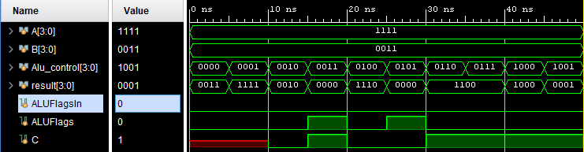
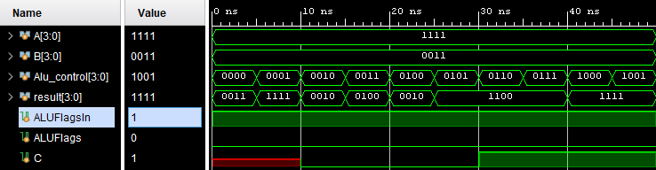

## 1. Abreviaturas y definiciones
- **FPGA**: Field Programmable Gate Arrays
- **FA**: Full Adder
- **RCA**: Ripple Carry Adder
- **CLA**: Carry Look-ahead Adder

## 2. Referencias
[0] David Harris y Sarah Harris. *Digital Design and Computer Architecture. RISC-V Edition.* Morgan Kaufmann, 2022. ISBN: 978-0-12-820064-3

[1] Features, 1., & Description, 3. (s/f). SNx4HC14 Hex Inverters with Schmitt-Trigger Inputs. Www.ti.com. https://www.ti.com/lit/ds/symlink/sn74hc14.pdf?ts=1709130609427&ref_url=https%253A%252F%252Fwww.google.com%252F


## 3. Desarrollo

### 3.1 Switches, botones y LEDs

El módulo `Nexis4` representa un sistema digital que lee el estado de interruptores y botones para controlar el estado de un conjunto de LEDs, apagando grupos específicos de LEDs según los botones presionados. La lógica es combinacional y la actualización de las salidas se realiza en respuesta a cambios en las entradas. Dado que la FPGA cuenta con 16 switches y 16 leds, cada uno de los leds representa el estado de los switches, y cada uno de los 4 botones se encarga de apagar un grupo de 4 leds. 

#### 1. Módulo
```SystemVerilog
module Nexis4(
  input logic   [3:0] swt, //Switches de entrada
  input logic	      btn, //Botones de entrada
  
  output logic  [3:0] led  //Leds de salida
);
  
  assign led[0] = btn ? 1'b0 : swt[0]; //Asignaciones para cada uno de los switches, botones y leds.
  assign led[1] = btn ? 1'b0 : swt[1];
  assign led[2] = btn ? 1'b0 : swt[2];
  assign led[3] = btn ? 1'b0 : swt[3];
endmodule
```

#### 2. Criterios y restricciones de diseño
Para llevar a cabo la implementación de esta aplicación, se requirió la configuración de los switches, LEDs y botones, los cuales funcionan tanto como entradas como salidas para el módulo. Se usaron funciones condicionales para asignar el botón a 4 switches y 4 LEDs.

Para los constraints, se utilizó una misma función del sistema que, al crear una síntesis, una implementación y el generador bitstream, emplea una ventana llamada I/O Ports, donde se asigna manualmente cada uno de los puertos de la FPGA utilizada. De esta manera, se genera un constraint específico para las necesidades expuestas en el código TOP, junto con sus instancias del código.

#### 3. Testbench y Implementación en la FPGA
Con el testbech ya funcionando, en el se simulan los switches de entrada, las led salida y los botones en ciertos caso se procedio a probarlo en la FPGA. El resultado fue satisfactorio, cada uno de los switches prendia su respectivo led y los botones apagaban los 4 leds que se le asignaron. 

### 3.2 Multiplexor 4 to 1

El módulo *multiplexor* representa un multiplexor de 4 entradas a 1 salida con un ancho de bus configurable. 

#### 1. Encabezado del módulo
```SystemVerilog
module mux4 #(parameter WIDTH = 8) (
    input clk,
    input rst,
    input  logic [WIDTH-1:0] in0, 
    input  logic [WIDTH-1:0] in1, 
    input  logic [WIDTH-1:0] in2,
    input  logic [WIDTH-1:0] in3,
    input  logic [1:0] sel,
    output logic [WIDTH-1:0] out
);
    always_comb begin
        case (sel)
            2'b00: out = in0;
            2'b01: out = in1;
            2'b10: out = in2;
            2'b11: out = in3;
            default: out = {WIDTH{1'bx}};
        endcase
    end
endmodule
```
#### 2. Parámetros

- `WIDTH`: Parámetro que define el ancho del bus de datos en el multiplexor. Tiene un valor predeterminado de 8, pero en el test bench este toma valores de 4, 8 y 16.


#### 3. Entradas y salidas

- `in_0`, `in_1`, `in_2`, `in_3`: Entradas de datos al multiplexor.
- `sel`: Entrada de 2 bits que especifica qué entrada del multiplexor se seleccionará.
- `out`: Salida del módulo, representa el dato seleccionado por el multiplexor según la entrada `sel`.


#### 4. Criterios de diseño

Para el diseño propuesto, se desarrolló un diagrama que ilustrata el sistema con las entradas y salidas. 

La imagen adjunta ilustra a nivel de bloques el sistema:

<div align="center">
  
</div>

Y la tabla de verdad que determina su comportamiento corresponde a: 

<div align="center">
  
</div>


#### 5. Testbench

El siguiente fragmento de código muestra una simplificación del test bench con la finalidad de poder visualizar su esctructura global y funcionamiento.

```SystemVerilog
module mux4tb;
    
    // Parámetros de prueba
    parameter NUM_SAMPLES = 50; // Número de datos de prueba

    // Señales de prueba
    logic clk, rst;
    logic [1:0] sel;
    logic [3:0] in0_4, in1_4, in2_4, in3_4, out_4;
    logic [7:0] in0_8, in1_8, in2_8, in3_8, out_8;
    logic [15:0] in0_16, in1_16, in2_16, in3_16, out_16;
    
    // Instancias del DUT (Multiplexor 4:1 para 4, 8 y 16 bits)
    mux4 #(4) uut4 (
        .clk(clk), .rst(rst),
        .in0(in0_4), .in1(in1_4), .in2(in2_4), .in3(in3_4),
        .sel(sel), .out(out_4)
    );

    mux4 #(8) uut8 (
        .clk(clk), .rst(rst),
        .in0(in0_8), .in1(in1_8), .in2(in2_8), .in3(in3_8),
        .sel(sel), .out(out_8)
    );

    mux4 #(16) uut16 (
        .clk(clk), .rst(rst),
        .in0(in0_16), .in1(in1_16), .in2(in2_16), .in3(in3_16),
        .sel(sel), .out(out_16)
    );

    // Generación del reloj (10 ns de período)
    always #5 clk = ~clk;

    // Proceso de prueba
    initial begin
        clk = 0;
        rst = 1;
        #10 rst = 0; // Desactiva reset después de 10 ns

        $display("=== Inicio de pruebas ===");

        // Pruebas para cada ancho de datos y cada selección de entrada
        for (sel = 0; sel < 4; sel++) begin
            $display("Probando sel = %b", sel);

            for (int i = 0; i < NUM_SAMPLES; i++) begin
                // Generar datos aleatorios
                in0_4 = $urandom_range(0, 15);
                in1_4 = $urandom_range(0, 15);
                in2_4 = $urandom_range(0, 15);
                in3_4 = $urandom_range(0, 15);

                in0_8 = $urandom_range(0, 255);
                in1_8 = $urandom_range(0, 255);
                in2_8 = $urandom_range(0, 255);
                in3_8 = $urandom_range(0, 255);

                in0_16 = $urandom_range(0, 65535);
                in1_16 = $urandom_range(0, 65535);
                in2_16 = $urandom_range(0, 65535);
                in3_16 = $urandom_range(0, 65535);

                #5; // Esperar 5 ns para estabilizar señales

                // Verificación de salida
                case (sel)
                    2'b00: begin
                        if (out_4 !== in0_4) $display("ERROR 4-bit: esperado=%h, obtenido=%h", in0_4, out_4);
                        if (out_8 !== in0_8) $display("ERROR 8-bit: esperado=%h, obtenido=%h", in0_8, out_8);
                        if (out_16 !== in0_16) $display("ERROR 16-bit: esperado=%h, obtenido=%h", in0_16, out_16);
                    end
                    2'b01: begin
                        if (out_4 !== in1_4) $display("ERROR 4-bit: esperado=%h, obtenido=%h", in1_4, out_4);
                        if (out_8 !== in1_8) $display("ERROR 8-bit: esperado=%h, obtenido=%h", in1_8, out_8);
                        if (out_16 !== in1_16) $display("ERROR 16-bit: esperado=%h, obtenido=%h", in1_16, out_16);
                    end
                    2'b10: begin
                        if (out_4 !== in2_4) $display("ERROR 4-bit: esperado=%h, obtenido=%h", in2_4, out_4);
                        if (out_8 !== in2_8) $display("ERROR 8-bit: esperado=%h, obtenido=%h", in2_8, out_8);
                        if (out_16 !== in2_16) $display("ERROR 16-bit: esperado=%h, obtenido=%h", in2_16, out_16);
                    end
                    2'b11: begin
                        if (out_4 !== in3_4) $display("ERROR 4-bit: esperado=%h, obtenido=%h", in3_4, out_4);
                        if (out_8 !== in3_8) $display("ERROR 8-bit: esperado=%h, obtenido=%h", in3_8, out_8);
                        if (out_16 !== in3_16) $display("ERROR 16-bit: esperado=%h, obtenido=%h", in3_16, out_16);
                    end
                endcase
            end
        end

        $display("=== Pruebas finalizadas ===");
        $stop;
    end

endmodule

```


Este test bench es utilizado para verificar el comportamiento del módulo multiplexor con diferentes configuraciones de ancho de bus. En el bloque initial, se inicia una simulación. Se generan datos aleatorios para las entradas del módulo (in0_4, in1_4, in2_4, in3_4) en un bucle de 50 iteraciones. Para cada iteración, se cambia la señal de selección (sel) para probar cada una de las entradas del multiplexor. Se espera un cierto número de unidades de tiempo después de cambiar la selección y se verifica que la salida del módulo (data_o) coincida con la entrada correspondiente y si hay alguna discrepancia, se imprime un mensaje de error y la simulación se detiene. Al final de la simulación, se muestra un mensaje indicando si la simulación terminó correctamente para un determinado ancho de bus (ANCHO).

Luego de la definición del bucle, se instancia tres test benches con diferentes anchuras de bus (4, 8, y 16). Esto permite ejecutar la simulación para varias configuraciones de anchura del bus del módulo multiplexor en una única simulación.

Luego de correr el test bench, se muestra el siguiente resultado:
<div align="center">
  
</div>
Se observan múltiples anchos de datos (4 bits, 8 bits y 16 bits), lo que sugiere que el multiplexor es parametrizable. Cada salida (out_4, out_8, out_16) parece coincidir con la entrada correspondiente seleccionada por sel[1:0]. Por medio de las transiciones se puede saber el funcionamiento del mux, en el diagrama de tiempos, los cambios en la señal de selección (sel) afectan la salida en los momentos esperados. No hay signos evidentes de propagación incorrecta de datos o glitches en los cambios de estado. Aunque hay valores "X" en las entradas, la salida no muestra comportamientos erráticos cuando sel tiene valores definidos.

### 3.3 Decodificador para display de 7 segmentos

#### 3.3.1 Decodificador simple (Parte 1) 
La primera parte del decodificador consiste en definir uno o varios módulos que reciban un valor binario representado por 4 bits y devuelva su representación hexadecimal. El decodificador es un circuito combinacional, es decir que las salidas solo dependen de las entradas y no de un estado anterior, una combinación de entrada entregará una salida específica por lo que se pueden igualar o asignar las variables entre sí. Para realizar esa tarea se utiliza la tabla de conversión de binaria 4 bits a hexadecimal. Además recordando que la salida quiere ser representada en un display de 7 segmentos, se investiga el funcionamiento del display de la FPGA a utilizar (Basys 3) y se determina que es de ánodo común por lo que un estado activo no será representado o establecido por un valor de "1" si no que con un "0" y el apagado con un "0" en lugar de un "1", de manera inversa al display que utiliza cátodo común. Con esta información se procede a  crear una tabla que relacione el número valor de entrada con su representación en hexadecimal y los segmentos activos/desactivados del display en la FPGA. Se acalara que el orden en los segmentos es de : 7'b abcdefg.
La siguiente tabla muestra la relación entre los números decimales, su representación binaria de 4 bits, su equivalente hexadecimal y los segmentos activos en el display de 7 segmentos.

<div align="center">
  
| Decimal    | Binario | Hexadecimal   | Display |
| --------- | ---- | -------- |-------- |
| 0      | 0000   | 0   | 7'b0000001|
| 1     | 0001   | 1|7'b1001111|
| 2      | 0010   | 2   |7'b0010010|
| 3     | 0011   | 3|7'b0000110|
| 4      | 0100   | 4   |7'b1001100|
| 5     | 0101   | 5|7'b0100100|
| 6      | 0110   | 6   |7'b0100000|
| 7     | 0111   | 7|7'b0001111|
| 8      | 1000   | 8   |7'b0000000|
| 9     | 1001   | 9|7'b0000100|
| 10      | 1010   | A   |7'b0001000|
| 11     | 1011   | B|7'b1100000|
| 12      | 1100   | C   |7'b0110001|
| 13     | 1101   | D|7'b1000010|
| 14      | 1110   | E   |7'b0110000|
| 15    | 1111   | F|7'b0111000|

</div>

Antes de empezar con el desarrollo del ejercicio se crea un diagrama de bloques para representar el orden del circuito combinacional, para ello se identifican las entradas y salidas, ademas de la lógica para llegar al resultado. 

<div align="center">
  
</div>

#### 1.  Encabezado del módulo
```SystemVerilog
module logica_deco(
    input [3:0] valor, 
    output reg [0:6] representacion 
    );
```

#### 2.  Entradas y salidas

- `valor`: Entrada de switches (anodos se repiten de 4 en 4)
- `representacion`: Salida a los switches (segmentos repetidos de 4 en 4 en el display)

#### 3.  Criterios de diseño

La implementación se hizo con un bloque always sensible al cambio de la entrada "valor", de manera que en cada cambio, se mapeaba el valor binario de 4 bits y se convierte a su representación hexadecimal con igualdades.

#### 4.  Testbench

Se crea un testbench simple en el que se prueban todos los posibles valores de la señal de entrada (del 0 al 15), y se muestran en la consola por medio de displays para verificar que sean correctos y el algoritmo funcione como se debe.

```SystemVerilog
module logica_deco_tb;

    // Definición de señales
    reg [3:0] valor;                   // Entrada
    wire [0:6] representacion;        // Salida
    
    // Instancia del módulo bajo prueba
    logica_deco DUT (
        .valor(valor),               // Conexión de la señal de entrada
        .representacion(representacion) // Conexión de la señal de salida
    );
    // Generación de estímulos
    initial begin
        // Inicializar valores
        valor = 4'b0000; // Ejemplo de entrada inicial
        #10; // Espera 10 unidades de tiempo
    
        // Cambiar la entrada y observar la salida
        valor = 4'b0001; // Cambiar la entrada a 1
        #10;             // Esperar un ciclo de reloj
        $display("Decimal: %d, Binario: %b, Hexadecimal (Ánodo Común): %h (AC), Segmentos (Binario): %b", valor, valor, valor, representacion);
        
        valor = 4'b0010; // Cambiar la entrada a 2
        #10;             // Esperar un ciclo del reloj
        $display("Decimal: %d, Binario: %b, Hexadecimal (Ánodo Común): %h (AC), Segmentos (Binario): %b", valor, valor, valor, representacion);

   [...]

        valor = 4'b1111; // Cambiar la entrada a 15
        #10;             // Esperar un ciclo del reloj
        $display("Decimal: %d, Binario: %b, Hexadecimal (Ánodo Común): %h (AC), Segmentos (Binario): %b", valor, valor, valor, representacion);
        
        // Terminar la simulación
        $finish;
    end

endmodule
```

La simulación se puede ver en la imagen siguiente: 

<div align="center">
  
</div>

Y los valores de la consola, correctos en cada prueba se miran a continuación:

```
Decimal:  1, Binario: 0001, Hexadecimal (Ánodo Común): 1 (AC), Segmentos (Binario): 1001111
Decimal:  2, Binario: 0010, Hexadecimal (Ánodo Común): 2 (AC), Segmentos (Binario): 0010010
Decimal:  3, Binario: 0011, Hexadecimal (Ánodo Común): 3 (AC), Segmentos (Binario): 0000110
Decimal:  4, Binario: 0100, Hexadecimal (Ánodo Común): 4 (AC), Segmentos (Binario): 1001100
Decimal:  5, Binario: 0101, Hexadecimal (Ánodo Común): 5 (AC), Segmentos (Binario): 0100100
Decimal:  6, Binario: 0110, Hexadecimal (Ánodo Común): 6 (AC), Segmentos (Binario): 0100000
Decimal:  7, Binario: 0111, Hexadecimal (Ánodo Común): 7 (AC), Segmentos (Binario): 0001111
Decimal:  8, Binario: 1000, Hexadecimal (Ánodo Común): 8 (AC), Segmentos (Binario): 0000000
Decimal:  9, Binario: 1001, Hexadecimal (Ánodo Común): 9 (AC), Segmentos (Binario): 0000100
Decimal: 10, Binario: 1010, Hexadecimal (Ánodo Común): a (AC), Segmentos (Binario): 0001000
Decimal: 11, Binario: 1011, Hexadecimal (Ánodo Común): b (AC), Segmentos (Binario): 1100000
Decimal: 12, Binario: 1100, Hexadecimal (Ánodo Común): c (AC), Segmentos (Binario): 0110001
Decimal: 13, Binario: 1101, Hexadecimal (Ánodo Común): d (AC), Segmentos (Binario): 1000010
Decimal: 14, Binario: 1110, Hexadecimal (Ánodo Común): e (AC), Segmentos (Binario): 0110000
Decimal: 15, Binario: 1111, Hexadecimal (Ánodo Común): f (AC), Segmentos (Binario): 0111000
```
#### 3.3.2 Decodificador seleccionable (Parte 2) 

La segunda parte del ejercicio del decodificador consiste en modificar el primer diseño de manera que los 16 switches totales se separen en grupos de 4 switches y con los botones se decida como moverse entre los displays. Para solucionar esta parte se piensa en 2 maneras distintas, la primera utiliza 4 botones, 1 asignado a un display distinto de manera que cuando se presione solamente se obtengan datos de sus switches específicos y la segunda solución es utilizar 2 botones que hagan que los display cambian hacia un lado o hacia el otro. Para ambos diseños se agrega un multiplexor 4 a 1 para poder multiplexar los switches de cada caso y para implementar el resto se piensa agregar lógica de compuertas OR en la primera opción de 4 botones, uno con cada display y para la segunda opción otro multiplexor para encender el ánodo específico que es movido por un contador interno que se mueve de 0 a 3. 

Antes de empezar con el desarrollo del ejercicio se crea un diagrama de bloques para representar el orden del circuito combinacional, para ello se identifican las entradas y salidas, ademas de la lógica para llegar al resultado. 

<div align="center">
  
</div>

#### Tabla de conversión múltiple:

La siguiente tabla muestra la tabla de verdad del selector para el multiplexor.

<div align="center">
  
| btn[3]    | btn[2] | btn[1]    |s[0] | s[1]|
| --------- | ---- | --------  |----- |----- |
| 0      | 0        | 0       |X      |X |
| 0      | 0        | 1       |      0|  1   |
| 0      | 1        | 0      |      1 |  0 |
| 1      | 0        | 0     |      1 |   1|


</div>

#### 1.  Encabezado del módulo

```SystemVerilog
module logica_deco2(
    input [3:0] btn,
    input [15:0] sw, 
    output reg [0:6] seg, 
    output [3:0] an, 
    output dp
    );
```
#### 2.  Entradas y salidas

- `btn`: Entrada de la señal de los botones escogidos
- `sw`: Entrada de los switches
- `seg`: Salida de la señal de los segmentos activos en display (Ánodo Común)
- `an`: Salida de activación de ánodos (Ánodo Común)

#### 3.  Criterios y restricciones de diseño

Se utiliza la misma implementación de conversión de la parte 1 pero se agrega un multiplexor para poder escoger los segmentos divididos de 4 en 4, esos segmentos están relacionados a un botón específico que activa un display propio en el que va a mostrar el mapeo de los switches en hexadecimal. Los botones utilizan compuertas OR para poder activarse. Para poder activar los botones y switches se activan partes las señales del "constraint" que corresponden a:

```SystemVerilog
# Switches
set_property PACKAGE_PIN V17 [get_ports {sw[0]}]					
	set_property IOSTANDARD LVCMOS33 [get_ports {sw[0]}]
set_property PACKAGE_PIN V16 [get_ports {sw[1]}]					
	set_property IOSTANDARD LVCMOS33 [get_ports {sw[1]}]
set_property PACKAGE_PIN W16 [get_ports {sw[2]}]					
	set_property IOSTANDARD LVCMOS33 [get_ports {sw[2]}]
set_property PACKAGE_PIN W17 [get_ports {sw[3]}]					
	set_property IOSTANDARD LVCMOS33 [get_ports {sw[3]}]
set_property PACKAGE_PIN W15 [get_ports {sw[4]}]					
	set_property IOSTANDARD LVCMOS33 [get_ports {sw[4]}]
set_property PACKAGE_PIN V15 [get_ports {sw[5]}]					
	set_property IOSTANDARD LVCMOS33 [get_ports {sw[5]}]
set_property PACKAGE_PIN W14 [get_ports {sw[6]}]					
	set_property IOSTANDARD LVCMOS33 [get_ports {sw[6]}]
set_property PACKAGE_PIN W13 [get_ports {sw[7]}]					
	set_property IOSTANDARD LVCMOS33 [get_ports {sw[7]}]
set_property PACKAGE_PIN V2 [get_ports {sw[8]}]					
	set_property IOSTANDARD LVCMOS33 [get_ports {sw[8]}]
set_property PACKAGE_PIN T3 [get_ports {sw[9]}]					
	set_property IOSTANDARD LVCMOS33 [get_ports {sw[9]}]
set_property PACKAGE_PIN T2 [get_ports {sw[10]}]					
	set_property IOSTANDARD LVCMOS33 [get_ports {sw[10]}]
set_property PACKAGE_PIN R3 [get_ports {sw[11]}]					
	set_property IOSTANDARD LVCMOS33 [get_ports {sw[11]}]
set_property PACKAGE_PIN W2 [get_ports {sw[12]}]					
	set_property IOSTANDARD LVCMOS33 [get_ports {sw[12]}]
set_property PACKAGE_PIN U1 [get_ports {sw[13]}]					
	set_property IOSTANDARD LVCMOS33 [get_ports {sw[13]}]
set_property PACKAGE_PIN T1 [get_ports {sw[14]}]					
	set_property IOSTANDARD LVCMOS33 [get_ports {sw[14]}]
set_property PACKAGE_PIN R2 [get_ports {sw[15]}]					
	set_property IOSTANDARD LVCMOS33 [get_ports {sw[15]}]
 
#7 segment display
set_property PACKAGE_PIN W7 [get_ports {seg[0]}]					
	set_property IOSTANDARD LVCMOS33 [get_ports {seg[0]}]
set_property PACKAGE_PIN W6 [get_ports {seg[1]}]					
	set_property IOSTANDARD LVCMOS33 [get_ports {seg[1]}]
set_property PACKAGE_PIN U8 [get_ports {seg[2]}]					
	set_property IOSTANDARD LVCMOS33 [get_ports {seg[2]}]
set_property PACKAGE_PIN V8 [get_ports {seg[3]}]					
	set_property IOSTANDARD LVCMOS33 [get_ports {seg[3]}]
set_property PACKAGE_PIN U5 [get_ports {seg[4]}]					
	set_property IOSTANDARD LVCMOS33 [get_ports {seg[4]}]
set_property PACKAGE_PIN V5 [get_ports {seg[5]}]					
	set_property IOSTANDARD LVCMOS33 [get_ports {seg[5]}]
set_property PACKAGE_PIN U7 [get_ports {seg[6]}]					
	set_property IOSTANDARD LVCMOS33 [get_ports {seg[6]}]

#Decimal Point
set_property PACKAGE_PIN V7 [get_ports dp]							
	set_property IOSTANDARD LVCMOS33 [get_ports dp]

#Anodes
set_property PACKAGE_PIN U2 [get_ports {an[0]}]					
	set_property IOSTANDARD LVCMOS33 [get_ports {an[0]}]
set_property PACKAGE_PIN U4 [get_ports {an[1]}]					
	set_property IOSTANDARD LVCMOS33 [get_ports {an[1]}]
set_property PACKAGE_PIN V4 [get_ports {an[2]}]					
	set_property IOSTANDARD LVCMOS33 [get_ports {an[2]}]
set_property PACKAGE_PIN W4 [get_ports {an[3]}]					
	set_property IOSTANDARD LVCMOS33 [get_ports {an[3]}]


#Buttons
set_property PACKAGE_PIN W19 [get_ports btn[2]]						
	set_property IOSTANDARD LVCMOS33 [get_ports btn[2]]

set_property PACKAGE_PIN U17 [get_ports btn[1]]						
	set_property IOSTANDARD LVCMOS33 [get_ports btn[1]]

set_property PACKAGE_PIN T18 [get_ports btn[3]]						
	set_property IOSTANDARD LVCMOS33 [get_ports btn[3]]

set_property PACKAGE_PIN T17 [get_ports btn[0]]						
	set_property IOSTANDARD LVCMOS33 [get_ports btn[0]]
```

Además, se aclara que si se apretan dos o más botones a la vez, los displays respectivos se activan pero solo recibiran la señal de uno de los 4 grupos de switches relacionados, por lo general será el defautl de 0 a 3. Se puede crear otro multiplexor para restringir este comportamiento pero por requisitos de diseño no es necesario, sería una funcionalidad extra, también se podría implementar algún tipo de debouncer o una lógica para bloquear los botones cuando se está presionando uno. 


#### 4.  Testbench

Se crea un testbench detallado para cada uno de los 15 valores en los 4 botones distintos, los resultados son esperados y correctos en cada señal.

```SystemVerilog
module logica_deco2_tb;

    // Definición de parámetros
    reg [3:0] btn;
    reg [15:0] sw;
    wire [0:6] seg;
    wire [3:0] an;
    wire dp;
    
    // Instancia del módulo bajo prueba
    logica_deco2 dut (
        .btn(btn),
        .sw(sw),
        .seg(seg),
        .an(an),
        .dp(dp)
    );
    
    // Estímulo de entrada
    initial begin
        // Inicializar entradas
        btn[3]= 0;
        btn[2]= 0;
        btn[1]= 0;
        btn[0]= 0;
        sw[15:12]= 4'b0000;
        sw[11:8]= 4'b0000;
        sw[7:4]= 4'b0000;  
        sw[3:0]= 4'b0000;  
        
        // Esperar un poco antes de empezar
        #10;
        
        // Cambiar las entradas para simular diferentes condiciones
        // Presionar botón 0 
        //Mapeo 0
        btn[3]= 0;
        btn[2]= 0;
        btn[1]= 0;
        btn[0]= 1;
        sw[3:0] = 4'b0000;
        #5;
        //Mapeo 1
        btn[3]= 0;
        btn[2]= 0;
        btn[1]= 0;
        btn[0]= 1;
        sw[3:0] = 4'b0001;
        #5;       
        //Mapeo 2
        btn[3]= 0;
        btn[2]= 0;
        btn[1]= 0;
        btn[0]= 1;
        sw[3:0] = 4'b0010;
        #5;       
        //Mapeo 3
        btn[3]= 0;
        btn[2]= 0;
        btn[1]= 0;
        btn[0]= 1;
        sw[3:0] = 4'b0011;
[...]

        // Presionar botón 1 
        //Mapeo 0
        btn[3]= 0;
        btn[2]= 0;
        btn[1]= 1;
        btn[0]= 0;
        sw[7:4] = 4'b0000;
        #5;
        //Mapeo 1
        btn[3]= 0;
        btn[2]= 0;
        btn[1]= 1;
        btn[0]= 0;
        sw[7:4] = 4'b0001;
        #5;       
        //Mapeo 2
        btn[3]= 0;
        btn[2]= 0;
        btn[1]= 1;
        btn[0]= 0;
        sw[7:4] = 4'b0010;
        #5;       
        //Mapeo 3
        btn[3]= 0;
        btn[2]= 0;
        btn[1]= 1;
        btn[0]= 0;
        sw[7:4] = 4'b0011;
        
        
[...]
        // Presionar botón 3 
        //Mapeo 0
        btn[3]= 1;
        btn[2]= 0;
        btn[1]= 0;
        btn[0]= 0;
        sw[15:12] = 4'b0000;
        #5;
        //Mapeo 1
        btn[3]= 1;
        btn[2]= 0;
        btn[1]= 0;
        btn[0]= 0;
        sw[15:12] = 4'b0001;
        #5;      
        //Mapeo 2
        btn[3]= 1;
        btn[2]= 0;
        btn[1]= 0;
        btn[0]= 0;
        sw[15:12] = 4'b0010;
        #5;       
        //Mapeo 3
        btn[3]= 1;
        btn[2]= 0;
        btn[1]= 0;
        btn[0]= 0;
        sw[15:12] = 4'b0011;

[...]
        
        // Terminar simulación
        $finish;
    end
    
    // Visualización de las salidas
    always @(*) begin
        $display("Botón Pulsado = %b , Display Activo = %b, Valor en Switches = %b, Valor en display= %b (AC)", btn, an, sw, seg);
    end

endmodule
```

Las señales de la simulación se pueden ver en las siguientes imágenes:

<div align="center">
  
</div>

<div align="center">
  
</div>

Los resultados en la consola son los siguientes:

```
Botón 0 
Botón Pulsado = 0000 , Display Activo = 1111, Valor en Switches = 0000000000000000, Valor en display= 0000001 (AC)
Botón Pulsado = 0001 , Display Activo = 1110, Valor en Switches = 0000000000000001, Valor en display= 1001111 (AC)
Botón Pulsado = 0001 , Display Activo = 1110, Valor en Switches = 0000000000000011, Valor en display= 0010010 (AC)
Botón Pulsado = 0001 , Display Activo = 1110, Valor en Switches = 0000000000000011, Valor en display= 0000110 (AC)
Botón Pulsado = 0001 , Display Activo = 1110, Valor en Switches = 0000000000000100, Valor en display= 1001100 (AC)
Botón Pulsado = 0001 , Display Activo = 1110, Valor en Switches = 0000000000000101, Valor en display= 0100100 (AC)
Botón Pulsado = 0001 , Display Activo = 1110, Valor en Switches = 0000000000000111, Valor en display= 0100000 (AC)
Botón Pulsado = 0001 , Display Activo = 1110, Valor en Switches = 0000000000001000, Valor en display= 0001111 (AC)
Botón Pulsado = 0001 , Display Activo = 1110, Valor en Switches = 0000000000001001, Valor en display= 0000000 (AC)
Botón Pulsado = 0001 , Display Activo = 1110, Valor en Switches = 0000000000001001, Valor en display= 0000100 (AC)
Botón Pulsado = 0001 , Display Activo = 1110, Valor en Switches = 0000000000001010, Valor en display= 0001000 (AC)
Botón Pulsado = 0001 , Display Activo = 1110, Valor en Switches = 0000000000001011, Valor en display= 1100000 (AC)
Botón Pulsado = 0001 , Display Activo = 1110, Valor en Switches = 0000000000001100, Valor en display= 0110001 (AC)
Botón Pulsado = 0001 , Display Activo = 1110, Valor en Switches = 0000000000001101, Valor en display= 1000010 (AC)
Botón Pulsado = 0001 , Display Activo = 1110, Valor en Switches = 0000000000001110, Valor en display= 0110000 (AC)
Botón Pulsado = 0001 , Display Activo = 1110, Valor en Switches = 0000000000001111, Valor en display= 0111000 (AC)

Botón 1
Botón Pulsado = 0010 , Display Activo = 1101, Valor en Switches = 0000000000010000, Valor en display= 0000001 (AC)
Botón Pulsado = 0010 , Display Activo = 1101, Valor en Switches = 0000000000100000, Valor en display= 1001111 (AC)
Botón Pulsado = 0010 , Display Activo = 1101, Valor en Switches = 0000000000110000, Valor en display= 0010010 (AC)
Botón Pulsado = 0010 , Display Activo = 1101, Valor en Switches = 0000000001000000, Valor en display= 0000110 (AC)
Botón Pulsado = 0010 , Display Activo = 1101, Valor en Switches = 0000000001010000, Valor en display= 1001100 (AC)
Botón Pulsado = 0010 , Display Activo = 1101, Valor en Switches = 0000000001100000, Valor en display= 0100000 (AC)
Botón Pulsado = 0010 , Display Activo = 1101, Valor en Switches = 0000000001110000, Valor en display= 0001111 (AC)
Botón Pulsado = 0010 , Display Activo = 1101, Valor en Switches = 0000000010000000, Valor en display= 0000000 (AC)
Botón Pulsado = 0010 , Display Activo = 1101, Valor en Switches = 0000000010100000, Valor en display= 0000100 (AC)
Botón Pulsado = 0010 , Display Activo = 1101, Valor en Switches = 0000000010110000, Valor en display= 0001000 (AC)
Botón Pulsado = 0010 , Display Activo = 1101, Valor en Switches = 0000000010110000, Valor en display= 1100000 (AC)
Botón Pulsado = 0010 , Display Activo = 1101, Valor en Switches = 0000000011000000, Valor en display= 0110001 (AC)
Botón Pulsado = 0010 , Display Activo = 1101, Valor en Switches = 0000000011010000, Valor en display= 1000010 (AC)
Botón Pulsado = 0010 , Display Activo = 1101, Valor en Switches = 0000000011100000, Valor en display= 0110000 (AC)
Botón Pulsado = 0100 , Display Activo = 1101, Valor en Switches = 0000000000000000, Valor en display= 0111000 (AC)

Botón 2
Botón Pulsado = 0100 , Display Activo = 1011, Valor en Switches = 0000000100000000, Valor en display= 0000001 (AC)
Botón Pulsado = 0100 , Display Activo = 1011, Valor en Switches = 0000000100000000, Valor en display= 1001111 (AC)
Botón Pulsado = 0100 , Display Activo = 1011, Valor en Switches = 0000001000000000, Valor en display= 0010010 (AC)
Botón Pulsado = 0100 , Display Activo = 1011, Valor en Switches = 0000001100000000, Valor en display= 0000110 (AC)
Botón Pulsado = 0100 , Display Activo = 1011, Valor en Switches = 0000010000000000, Valor en display= 1001100 (AC)
Botón Pulsado = 0100 , Display Activo = 1011, Valor en Switches = 0000011000000000, Valor en display= 0100100 (AC)
Botón Pulsado = 0100 , Display Activo = 1011, Valor en Switches = 0000011100000000, Valor en display= 0100000 (AC)
Botón Pulsado = 0100 , Display Activo = 1011, Valor en Switches = 0000100000000000, Valor en display= 0001111 (AC)
Botón Pulsado = 0100 , Display Activo = 1011, Valor en Switches = 0000100100000000, Valor en display= 0000000 (AC)
Botón Pulsado = 0100 , Display Activo = 1011, Valor en Switches = 0000101000000000, Valor en display= 0000100 (AC)
Botón Pulsado = 0100 , Display Activo = 1011, Valor en Switches = 0000101100000000, Valor en display= 0001000 (AC)
Botón Pulsado = 0100 , Display Activo = 1011, Valor en Switches = 0000110000000000, Valor en display= 1100000 (AC)
Botón Pulsado = 0100 , Display Activo = 1011, Valor en Switches = 0000110100000000, Valor en display= 0110001 (AC)
Botón Pulsado = 0100 , Display Activo = 1011, Valor en Switches = 0000111000000000, Valor en display= 1000010 (AC)
Botón Pulsado = 0100 , Display Activo = 1011, Valor en Switches = 0000111100000000, Valor en display= 0110000 (AC)
Botón Pulsado = 0100 , Display Activo = 1011, Valor en Switches = 0000111100000000, Valor en display= 0111000 (AC)

Botón 3
Botón Pulsado = 1000 , Display Activo = 0111, Valor en Switches = 0000000000000000, Valor en display= 0000001 (AC)
Botón Pulsado = 1000 , Display Activo = 0111, Valor en Switches = 0001000000000000, Valor en display= 1001111 (AC)
Botón Pulsado = 1000 , Display Activo = 0111, Valor en Switches = 0010000000000000, Valor en display= 0010010 (AC)
Botón Pulsado = 1000 , Display Activo = 0111, Valor en Switches = 0011000000000000, Valor en display= 0000110 (AC)
Botón Pulsado = 1000 , Display Activo = 0111, Valor en Switches = 0101000000000000, Valor en display= 1001100 (AC)
Botón Pulsado = 1000 , Display Activo = 0111, Valor en Switches = 0110000000000000, Valor en display= 0100100 (AC)
Botón Pulsado = 1000 , Display Activo = 0111, Valor en Switches = 0111000000000000, Valor en display= 0100000 (AC)
Botón Pulsado = 1000 , Display Activo = 0111, Valor en Switches = 0111000000000000, Valor en display= 0001111 (AC)
Botón Pulsado = 1000 , Display Activo = 0111, Valor en Switches = 1000000000000000, Valor en display= 0000000 (AC)
Botón Pulsado = 1000 , Display Activo = 0111, Valor en Switches = 1010000000000000, Valor en display= 0000100 (AC)
Botón Pulsado = 1000 , Display Activo = 0111, Valor en Switches = 1011000000000000, Valor en display= 0001000 (AC)
Botón Pulsado = 1000 , Display Activo = 0111, Valor en Switches = 1100000000000000, Valor en display= 1100000 (AC)
Botón Pulsado = 1000 , Display Activo = 0111, Valor en Switches = 1101000000000000, Valor en display= 0110001 (AC)
Botón Pulsado = 1000 , Display Activo = 0111, Valor en Switches = 1110000000000000, Valor en display= 1000010 (AC)
Botón Pulsado = 1000 , Display Activo = 0111, Valor en Switches = 1111000000000000, Valor en display= 0110000 (AC)
Botón Pulsado = 1000 , Display Activo = 0111, Valor en Switches = 1111000000000000, Valor en display= 0111000 (AC)
```

### 3.4 Sumador y Ruta crítica

Problema: Crear un sumador completo de 1 bit y diseñar un Ripple-Carry Adder (RCA) con tamaño de palabra parametrizable.

Organización: Se deben plantear la tablas de verdad del sumador completo de 1 bit, así, obtener los mapas de karnaugh y plantear las ecuaciones para obtener el resultado, el RCA consiste en un ciclo del sumador anterior.

#### 1.Código final Bit Adder
```SystemVerilog
 `timescale 1ns / 1ps

module BitAdder 
(     
    input logic    a,                              
                   b,                              
                   c,                                
    output logic   cout,                            
                   sum 
 );                            
    
    assign cout = (b & c) |                       
                  (b & a) |                      
                  (a & c); 
                   
    assign sum =  (~b & ~a &  c) |              
                  ( b & ~a & ~c) |              
                  ( b &  a &  c) |
                  (~b &  a & ~c);
endmodule
```
Seguidamente el RCA consiste en iterar el modulo anterior N veces según los bits requeridos.

#### 2. Código final del RCA
```SystemVerilog
module RippleCarryAdder #(parameter N = 8)(
    input  logic [N-1:0] i_a,                  
    input  logic [N-1:0] i_b,
    output logic [N:0] o_suma);
 
    
    logic [N:0]   carry;                        
    logic [N-1:0]   sum;
   
    assign carry[0] = 1'b0;                                               
    
    genvar i;                                     
    generate
        for (i = 0; i < N; i=i+1)             
            begin
                BitAdder param(              
                .a         (i_a[i]),
                .b         (i_b[i]),
                .c         (carry[i]),
                .cout      (carry[i+1]),
                .sum       (sum[i])
                );
            end
    endgenerate
    
    assign o_suma = {carry[N], sum};            
endmodule
```
Para finalizar el CLA es prácticamente lo mismo, la diferencia esta en los propagadores y generadores que creamos para poder saber el comportamiento pasada la suma.

#### 3. Código final del LCA
```SystemVerilog
module CarryLookAhead#(parameter N = 8)
(
    input  logic [N-1:0] i_a,                 
    input  logic [N-1:0] i_b,
    output logic [N:0]   o_suma
);
    
    logic [N:0]   carry;
    logic [N-1:0] sum;                         
    logic [N-1:0] pro;                           
    logic [N-1:0] gen;                           
    
    genvar i;                                      
    generate                                        
        for (i = 0; i<N; i=i+1)
            begin
               BitAdder param(      
                .a         (i_a[i]),             
                .b         (i_b[i]),
                .c        (carry[i]),
                .cout       (),
                .sum        (sum[i])
                );
            end
    endgenerate
    
    assign carry[0] = 1'b0;                         
    
    genvar j;
    generate                                       
        for (j = 0; j<N; j=j+1)            
            begin
                assign gen[j]       = i_a[j] & i_b[j];
                assign pro[j]       = i_a[j] | i_b[j];
                assign carry[j+1] = gen[j] | (pro[j] & carry[j]);
            end
    endgenerate

    assign o_suma = {carry[N], sum};        

endmodule
```

#### 4. Criterios de diseño

Organización: Se deben plantear la tablas de verdad del sumador completo de 1 bit, así, obtener los mapas de karnaugh y plantear las ecuaciones para obtener el resultado, el RCA consiste en un ciclo del sumador anterior.

Solución:


-Tabla de la verdad para la suma


-Mapa de Karnaugh para la suma 


-Tabla de la verdad  para el carry


-Mapa de Karnaugh para la suma


#### 5. Testbench
```
module RippleCarryAdder128_TB;

    parameter N = 128;
    
    logic [N -1:0] i_a;
    logic [N -1:0] i_b;
    logic [N :0] o_suma;
    
    
    
    RippleCarryAdder #
    (
    .N (N)
    )
    test
    (
    .i_a            (i_a),
    .i_b            (i_b),
    .o_suma         (o_suma)
    );
    
    
    initial begin   
        repeat (10) begin
            
            i_a = 128'h35F8A2E71B3D0C49B2DCE1D789263F2A;
            i_b = 128'hA9C7D8F502E1346B5798C84A76BDF4A3;
            //DFC0DB7C24F440B0A2D0A042EF60DDEA
            
            #100;
            i_a = 128'h874E5A214F1D20C3BBE6071E5240F86C;
            i_b = 128'h2ECFBC91D78351A1E497D5AAEC9FDF8B;
            //BDADE7B3C6A0716530553D7C3FA17FF7
            #100;
            i_a = 128'hF56A0CEFA8B1F5C3F020A12A7589E42D;
            i_b = 128'hFBD8A7266611F3DBE90A0B8B024A493;
            //14A7F8BB5F1D0F1F4E0AAA3D1CD3E8C1A
        end
    #10;
    
    $finish;
    
    end
    
    RippleCarryAdder_TB TEST();
    CarryLookAhead_TB TEST2();

endmodule

 module RippleCarryAdder_TB;

    parameter N = 8;
    
    logic [N -1:0] i_a;
    logic [N -1:0] i_b;
    logic [N :0] o_suma;
    
    
    
    RippleCarryAdder #
    (
    .N (N)
    )
    test
    (
    .i_a            (i_a),
    .i_b            (i_b),
    .o_suma         (o_suma)
    );
    
    
    initial begin   
        repeat (10) begin
            

            i_a = 8'h00;
            i_b = 8'hff;
            
            #100;
            i_a = 8'haa;
            i_b = 8'h55;
            
            #100;
            i_a = 8'h11;
            i_b = 8'h22;
        end
    #10;
    
    $finish;
    
    end 
    
endmodule

module RippleCarryAdder #(parameter N = 8)(
    input  logic [N-1:0] i_a,                  
    input  logic [N-1:0] i_b,
    output logic [N:0] o_suma);
 
    
    logic [N:0]   carry;                        
    logic [N-1:0]   sum;
   
    assign carry[0] = 1'b0;                                               
    
    genvar i;                                     
    generate
        for (i = 0; i < N; i=i+1)             
            begin
                BitAdder param(              
                .a         (i_a[i]),
                .b         (i_b[i]),
                .c         (carry[i]),
                .cout      (carry[i+1]),
                .sum       (sum[i])
                );
            end
    endgenerate
    
    assign o_suma = {carry[N], sum};            
endmodule

```
###5. Resultados


Funcionamiento del Bit Adder


Funcionamiento del RCA y CLA


### 3.5 Unidad aritmética lógica (ALU)
El modulo ALU realiza operaciones aritméticas y logicas con operandos `A` y `B` parametrizados. La entrada `Alu_control` permite 4 bits representados del 1 hasta el 9 en hexadecimal que dictan cual sera la operación que se usara. 

La ALU tiene una entrada `ALUFlagIn` la cual tiene diferentes propositos segun la operación que se elija mediante el Alu_control. Para suma y resta de complemento A2 corresponde al carry de entrada, donde indica si hay acarreo de entrada, para el `NOT`, `Incremento` y `Decremento` dependiendo del valor binario 0 o 1 especifíca cual operando (A o B) se debe usar además menciona que bit (0 o 1) se agrega en los corrimientos de bits. Para los demás no tiene ninguna influencia. 

El resultado de la operación se le  salida `result`, mientras que la salida `ALUFlags` muestra cuando el resultado de la operación es 0. Finalmente se tiene `C` que es el bit de acarreo para cualquier suma o resta y para mostra cual fue el último bit que se eliminó en el corrimiento. 
 
#### 1. Encabezado del módulo
```SystemVerilog
`timescale 1ns / 1ps

module Alu #(
parameter n = 4)
(
 input logic [n-1:0] A,		//Entrada A
 input logic [n-1:0] B,		//Entrada B
 input logic [3:0] Alu_control, //Entrada que define que operación usar
 input logic       ALUFlagsIn,  //Entrada que define ciertas caracteriticas de la operaciones
 
 output logic [n-1:0] result,	//Resultados de la operaciones
 output logic       ALUFlags,	//Salida en caso de que la operacion sea 0
 output logic       C		//Salida de carries y bits borrados en los corrimientos
    ); 
```
#### 2. Criterios de diseño

Para el funcionamiento de la ALU, se utiliza un bloque `always_comb`, el cual, mediante un case, decide qué operación seleccionar dependiendo de la entrada `ALU_control`. De esta forma, la ALU sabe qué operación realizar.

Para realizar las operaciones, se optó por utilizar un sistema de decisiones mediante un código: `resultado = (condicional) ? valor_si_cumple : valor_sino_cumple;`. Por medio de este código, se usaron condicionales afectados por la entrada binaria `ALUFlagsIn`. Esta entrada decide algunos cambios dentro del código, como por ejemplo qué entrada usar para ciertas operaciones o con qué valor binario rellenar en los corrimientos. De este modo, tenía poder sobre algunas opciones que afectaban el resultado.

Para los resultados de suma y resta en complemento A2, se usó `signed()` para hacerle entender a la máquina que es un grupo de bits con signo. Para otros casos lógicos, se utilizaron los valores conocidos para AND, OR y XOR. Se agregó un diseño lógico para los corrimientos de bits y otro con una resta cumple con lo solicitado. Finalmente, se agregó una salida extra llamada `C` para obtener los bits de carry y los bits eliminados por el corrimiento de bits por medio de un concatenación de salida donde el bit más significativo caia en `C` y los todos los demás en `result`. 

Lo ultimo fueron arreglos para que no hubieran errores como el `default` para mandar un 0 en caso de que hibuera un error.


#### 3. Testbench

Se hace un testbench para simular las distintas operaciones de la ALU. EL testbench que se realiza utiliza un valor establcido para los operandos `A` y `B` y para la entrada `ALUFlagIn` una prueba con una bit de 1 y 0, para el caso de la entrada `Alu_control` se agrega cada una de las opciones del case en hexadeciamal para observar cada una de los resultados.

```SystemVerilog
odule Alu_tb;

logic [3:0] A;
logic [3:0] B;
logic [3:0] Alu_control;
logic       ALUFlagsIn;

logic [3:0] result;
logic       ALUFlags;
logic       C; 

Alu Alu_X(
.A              (A),
.B              (B),
.Alu_control    (Alu_control),
.result         (result),
.ALUFlagsIn     (ALUFlagsIn),
.ALUFlags       (ALUFlags),
.C              (C)
    );


initial begin
$dumpfile("Alu_tb.vcd");
$dumpvars(0, Alu_tb);

 A = 4'b1111;
 B = 4'b0011;
 ALUFlagsIn = 1'b1;
 Alu_control = 4'h0; //and
 
 #5
 
 Alu_control = 4'h1; //or
 
 #5
 
 Alu_control = 4'h2; //suma
 
 #5
 
 Alu_control = 4'h3; //A(0) B(1)suma 1 
 
 #5

 Alu_control = 4'h4; //A(0) B(1)resta 1
 
 #5
 
 Alu_control = 4'h5; //not
 
 #5
 
 Alu_control = 4'h6; //resta
 
 #5
 
 Alu_control = 4'h7; //xor
 
 #5
 
 Alu_control = 4'h8; //corrimiento izquierda
 
 #5
 
 Alu_control = 4'h9; //corrimiento derecha
 
 #5
$finish;
end
endmodule
```
En la siguientes imagenes se muestran los resultados de la simulaciones obtenidas.



Resultado de las operacion con ALUFlagsIn=0



Resultado de las operacion con ALUFlagsIn=1


De estas imagenes podemos observar que los resultados son correctos, el unico inconveniente es que el valor `C` no se pudo controlar como se esperaba, debido a que no se econtro una forma que pudiera cambiar el valor a 0 cada vez que no se necesitaba, no obstante si funciona cuando se tiene que utilizar nada más que mantiene su valor anterior.
